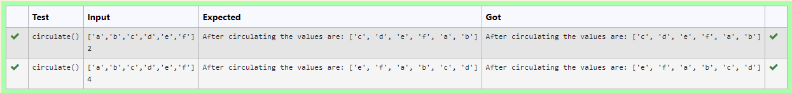

# Circulate-the-values-of-N-variables
## Aim:
To write a python program to circulate the n variables using function concept
## Equipment’s required:
PC
Anaconda - Python 3.7
## Algorithm:

### Step 1:
Creating a finction named circulate 

### Step 2:
Getting input for list and integer for circulating 

### Step 3: 
Get the value from the user for the number of rotation
### Step 4: 
Using the slicing concept rotate the list
### Step 5: 
Printing the list after circulating
 
## Program:
```
#Program to circulate N values.
#Developed by: P NAVEEN KUMAR
#RegisterNumber:22009215
def circulate():
    a=eval(input())
    b=int(input())
    print("After circulating the values are:",a[b:]+a[:b])
```

## Output:


## Result:
thus the python program of circulate the values of n variables is executed successfully
